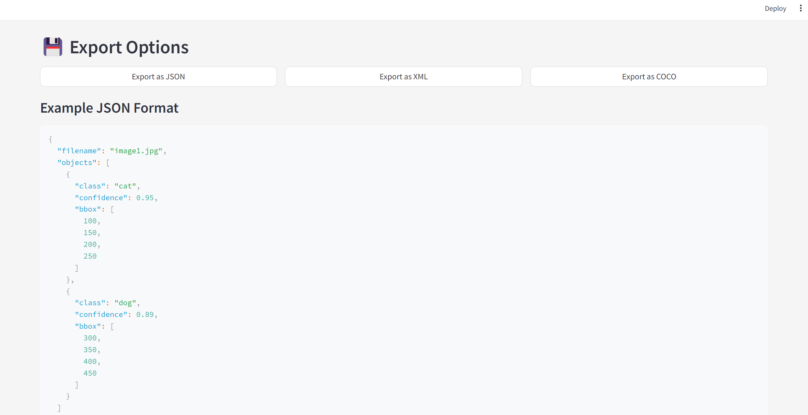

# Advanced Object Detection & Segmentation

🔍 A feature-rich Streamlit-based application for advanced object detection and segmentation using YOLOv8. This tool allows users to upload images, detect objects, visualize results, and export data in various formats (JSON, XML, COCO).

## Features
- **YOLOv8 Segmentation**: Leverages YOLOv8's segmentation capabilities for precise object detection and segmentation.
- **Batch Processing**: Upload and process multiple images simultaneously.
- **Interactive Visualizations**: Annotated images and analytics dashboards for object distribution and confidence scores.
- **Export Options**: Export detection results in JSON, XML, or COCO format.
- **Customizable Layout**: Modern UI with custom styling.

## Prerequisites
1. Python 3.8+
2. Install dependencies:
   ```bash
   pip install streamlit ultralytics supervision opencv-python numpy pillow torch plotly pandas dicttoxml pycocotools
   ```

## How to Run
1. Clone the repository:
   ```bash
   git clone <repository_url>
   cd <repository_name>
   ```
2. Start the Streamlit app:
   ```bash
   streamlit run app.py
   ```
3. Upload your images and explore the features.

## Screenshots
### 1. Upload Images


### 2. Annotated Images


### 3. Analytics Dashboard


### 4. Export Options


## File Structure
```
.
├── app.py                 # Main application code
├── assets/                # Folder for screenshots and assets
├── requirements.txt       # List of dependencies
└── README.md              # Documentation
```

## Example Outputs
### JSON Format
```json
{
  "filename": "image1.jpg",
  "objects": [
    {"class": "cat", "confidence": 0.95, "bbox": [100, 150, 200, 250]},
    {"class": "dog", "confidence": 0.89, "bbox": [300, 350, 400, 450]}
  ]
}
```

### XML Format
```xml
<detection_results>
    <item>
        <filename>image1.jpg</filename>
        <objects>
            <item>
                <class>cat</class>
                <confidence>0.95</confidence>
                <bbox>[100, 150, 200, 250]</bbox>
            </item>
            <item>
                <class>dog</class>
                <confidence>0.89</confidence>
                <bbox>[300, 350, 400, 450]</bbox>
            </item>
        </objects>
    </item>
</detection_results>
```

## Contributing
Contributions are welcome! Fork this repository, make your changes, and submit a pull request.

## License
This project is licensed under the MIT License.
